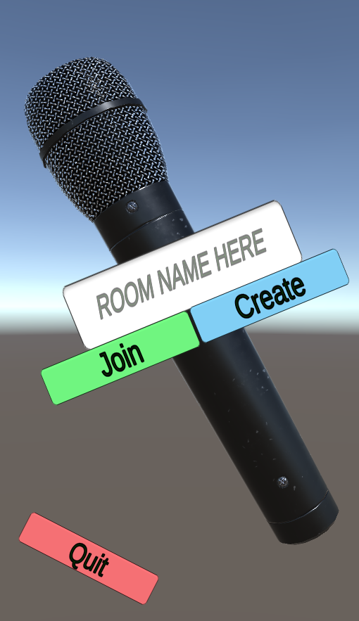

## iPrivate-i
# Multiplayer menu in Unity using PUN (also has animations)

Part of my first attempt at making a Unity Game

I've attached some images of how it looks. After a spawn-in animation, one has the following screen where one is prompted for a room name.

This comes complete with error pop-ups where required. An example of a mid-animation shot is shown below when a user has tried to create a room which has already been created.

Once a player has joined or created a room, they are given an animation culminating with this screen. Note the room title "test" showing. I have used PUN to execute the connections to the room.

A player selects a name and then waits for the host to start. The local player's name is shown in bold, and the host is tagged with a "Host" text element. This screen naturally also has error pop-ups, for instances such as choosing a name that has already been picked and for trying to start when one is not the host. An example of a mid-animation pop-up is shown below.

